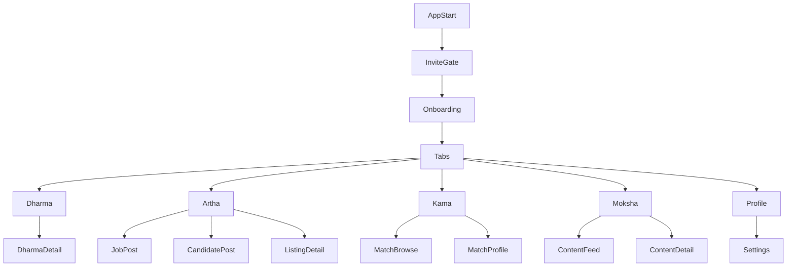

## Execution status
- PRD completed: [PRD.md](./PRD.md)
- Screen flows completed: [mvp_screen_flows.md](./mvp_screen_flows.md)
- Data model and API completed: [mvp_data_model_api.md](./mvp_data_model_api.md)
- Tech stack decision completed: [mvp_tech_stack.md](./mvp_tech_stack.md)

## Product definition
Śeṣa is a community app for people in (or interested in) the Ramanuja Sampradaya, organized around the four Purusharthas: **Dharma**, **Artha**, **Kama**, **Moksha**. The UI should feel modern, calm, and functional (not flashy), with pillar-specific experiences that fit the use-case (e.g., matchmaking UI for Kama, job portal UI for Artha).

## Target users & personas (MVP)
- **Existing community member**: wants Sampradaya-aligned networking, content, and community.
- **Seeker/newcomer (invite-only)**: wants guided discovery and respectful participation.
- **Organizer / seva coordinator**: wants to post seva opportunities and manage participation.
- **Recruiter / hiring manager**: wants to post jobs and review candidates within the community.
- **Matchmaking participant (self/guardian)**: wants profiles, filters, and safe contact pathways.

## Key decisions (locked from your inputs)
- **Platform**: Mobile app for iOS + Android.
- **Access**: Invite-only / referral codes.
- **Locale**: India-first; **Tamil + English**.
- **MVP depth**: Go **deeper on Kama + Artha**; Moksha + Dharma start simpler.

## Information architecture & navigation
- **Bottom tab bar (5 icons)**:
  - `Dharma`
  - `Artha`
  - `Kama`
  - `Moksha`
  - `Profile` (includes settings)

- **Global patterns** (consistent across tabs):
  - Top search (contextual to each pillar)
  - Saved items/bookmarks
  - Reporting/blocking
  - Language toggle (Tamil/English) at app level and per-content where relevant

### Navigation map (mermaid)

## MVP scope by pillar
### Kama (deep MVP): matchmaking
**Goal**: Sampradaya-oriented matchmaking experience with a clean, respectful profile-first flow.

**Core MVP features**
- **Match profile** (built from core profile + Kama-specific fields)
  - Photos (optional, governed by preferences)
  - Basic biodata: age, height, education, work, city, language
  - Sampradaya-oriented fields (kept respectful and optional): acharya lineage preference, temple affiliation, practice preferences
  - Interests/values prompts (short, structured)
  - Family/guardian contact preference (optional)
- **Browse / discovery**
  - Primary: **card/list browse** (not overly gamified)
  - Secondary: “recommended” list based on filters
- **Filters**
  - Location radius / city
  - Age range
  - Language (Tamil/English)
  - Education, occupation
  - Key preferences (customizable)
- **Express interest**
  - Like/Interest + optional short note
  - Mutual interest unlocks next step
- **Contact flow (MVP-safe)**
  - Start with **in-app intro request** (no raw phone numbers by default)
  - Optional: reveal contact if both opt-in
- **Safety**
  - Block/report
  - Screenshots discouraged; watermarking is optional (decide later)

**Out of scope for MVP (V1.5+)**
- Real-time chat with media, voice notes
- Complex horoscope/astrology modules
- Fully automated match scoring with ML

### Artha (deep MVP): careers & opportunities
**Goal**: LinkedIn-style community job marketplace + candidate discovery.

**Core MVP features**
- **Job posts**
  - Create/edit job listings (title, company, location, remote/on-site, salary range optional, requirements)
  - Tagging (skills, experience)
  - Apply intent: “Apply in app” (profile-based) or external link
- **Candidate posts**
  - “Open to work” cards with role preferences, location, experience, skills
- **Search & filters**
  - Jobs: location, experience level, skills tags
  - Candidates: skills, location, experience
- **Simple messaging / contact (MVP-safe)**
  - Intro request: candidate can approve contact
  - If messaging exists in MVP: start with **structured contact request** rather than full chat
- **Trust layer (lightweight)**
  - “Community verified” badge only if invite chain supports it (optional)

**Out of scope for MVP (V1.5+)**
- Full ATS pipeline, interview scheduling, document upload flows

### Moksha (simple MVP): spiritual feed + discussion
**Goal**: A calm feed for curated spiritual content and respectful Q&A.

**Core MVP features**
- **Feed**
  - Link posts (YouTube, playlists, other sources)
  - Short text posts (announcements, pointers)
- **Content detail**
  - Comments (threaded optional; can start flat)
  - Save/bookmark
- **Topics & filters**
  - Upanyasakar/teacher
  - Topic tags
  - Language (Tamil/English)
- **Ask a question**
  - Lightweight Q&A post type with tagging

**Out of scope for MVP**
- Live streaming
- Advanced learning paths/courses

### Dharma (simple MVP): seva/services + daily practice support
**Goal**: Service-oriented space for duties, seva opportunities, and day-to-day practice nudges.

**Core MVP features**
- **Dharma board**
  - Seva opportunities (time/place, description, signup)
  - Temple/community announcements
- **Signup + attendance intent**
  - “Interested/Going” with capacity limit (optional)
- **Personal practice (very light)**
  - Optional daily checklist (private to user)

**Out of scope for MVP**
- Complex volunteering shift management
- Donations/payments

## Cross-cutting: Profile, identity, and invites
### Profile (single source of truth)
- **Core profile** used across pillars: name/display name, city, languages, short bio, interests, role tags.
- Pillar extensions:
  - **Kama**: biodata + preferences
  - **Artha**: work history/skills
- **Privacy controls**
  - Hide phone/email by default
  - Control who can see Kama profile (e.g., “visible only in Kama tab”)

### Invite-only model (MVP)
- Users join via **referral code** (single-use or limited-use)
- Invite chain stored for moderation leverage (light)

## Content moderation & safety (MVP requirements)
- Report reasons: harassment, impersonation, spam, inappropriate content
- Block user (global across pillars)
- Admin console (MVP-lite): view reports, disable accounts, remove posts
- Rate limits for spam prevention (posting, comments, likes/interests)

## Localization (Tamil + English)
- App UI strings localized.
- Content language tagging (Tamil/English/Mixed)
- Search should respect language tags; allow “show all” fallback.

## Non-functional requirements
- **Performance**: fast cold start, smooth feed scroll, efficient image loading.
- **Accessibility**: readable typography, contrast-safe palette, scalable text.
- **Data**: backups, audit logs for moderation actions.
- **Security**: secure auth, encrypted storage of sensitive profile fields.

## Analytics (minimal but essential)
- Activation: invite → signup completion → first action per pillar
- Engagement: DAU/WAU, feed sessions, saves
- Kama: profile completion %, interests sent/received, mutual matches
- Artha: jobs posted, applications/intros requested, contact approvals
- Safety: reports per DAU, action time to resolve

## Rollout plan (suggested)
- **Alpha (closed)**: invite-only small cohort; validate Kama+Artha flows.
- **Beta**: expand invites; add moderation tooling; harden localization.
- **V1 launch**: stable matchmaking + jobs; Moksha+Dharma feeds reliable.

## Resolved implementation choices
- MVP uses **structured intro/contact requests only**, not full in-app chat.
- Kama visibility defaults to **Kama-only** and can be paused by the user.
- Guardian participation is **opt-in at the profile level**.
- Admin tooling ships as a **separate web console**.

## Implementation next steps
- Scaffold the mobile app, backend API, and admin console using the recommended stack.
- Convert screen flows into high-fidelity UX wireframes, prioritizing Kama and Artha.
- Translate the data model into migrations, validation schemas, and endpoint contracts.
- Define alpha cohort size, invite issuance rules, and moderation operating process.
